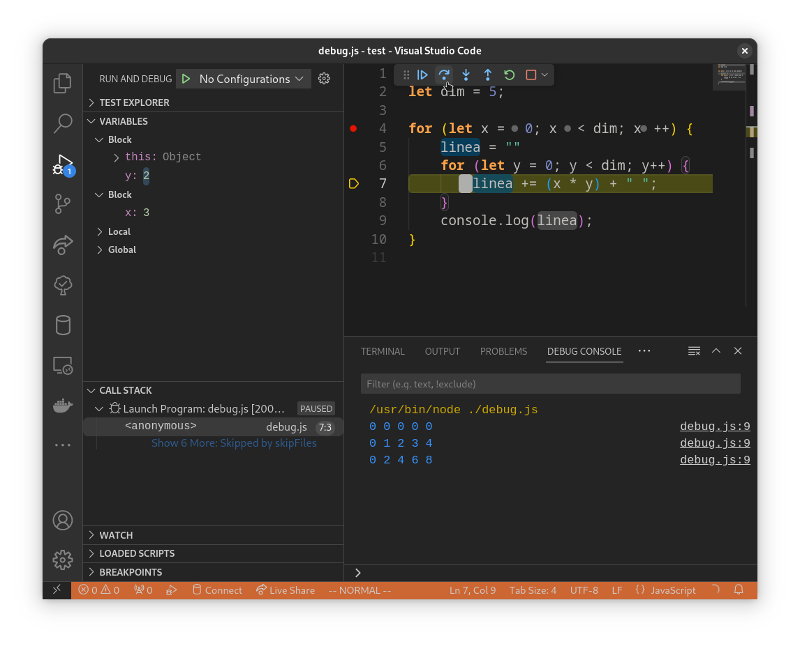

<script src="../node_modules/mermaid/dist/mermaid.min.js"></script>
<script>mermaid.initialize({startOnLoad:true, theme:"neutral", mirrorActors:false});</script>

<link rel="stylesheet" href="res/styles.css">
<link rel="stylesheet" href="res/fontawesome.css">

<!-- _paginate: false -->

# Sviluppo web con Javascript
### Valerio Iacobucci ([@iacobucci](https://github.com/iacobucci))


1. **Scripting**
2. **DOM**
3. **Controller**
4. **Model**
5. **View**
6. **Strumenti avanzati**

---

<!-- _backgroundColor: var(--main-color) -->
<!-- _color: white -->
<!-- _paginate: false -->

# Lezione 1
## Scripting

---
L'obiettivo del corso è imparare a sviluppare applicazioni web con gli strumenti più essenziali, moderni e facili da usare. Useremo Javascript per tutto il corso.

<div class="container">
<div class="content" style="align-items: unset">

### C, basso livello

```c
#include <stdio.h>

int main(){
	char *s = "Hello, world!";
	printf("%s\n", s);
}
```

Compilato, tipi statici + puntatori, gestione della memoria, imperativo, applicazioni di sistema.
</div>

<div class="content" style="align-items: unset">

### Javascript, alto livello

```javascript
let s = "Hello, world!"
console.log(s)
```

Interpretato, tipi dinamici, garbage collection, imperativo + orientato agli oggetti + funzionale, applicazioni web (+ di sistema).

</div>
</div>

---

## Caso di studio

Svilupperemo un gestionale per *amministrazione di condomini*, alla quale possono accedere i residenti e gli amministratori. Mostriamo un **diagramma dei casi d'uso**.
<br>

<div class="content">
<div class="mermaid" style="width: 45%">
%%{init: {'theme': 'neutral', 'mirrorActors': false } }%%
flowchart LR
	USER[Utente] --> REGISTRAZIONE[Registrazione]
	REGISTRAZIONE --> LOGIN[Login]
	ADMIN[Amministratore] --> LOGIN
	DASHBOARD --> VISUALCONDO
	DASHBOARD --> GESTCONDO
	subgraph Admin
		GESTCONDO[Gestisci Condominio] --> GESTRES
		GESTRES[Gestisci Residenti] --> GESTPAGAM[Gestisci Pagamento]
	end
	subgraph Utente
		VISUALCONDO[Visualizza Condominio] --> VISUALPAGAM[Visualizza Pagamento]
	end
	LOGIN --> DASHBOARD[Dashboard]
	style USER fill:#224466,color:#fff
	style ADMIN fill:#224466,color:#fff

</div>
</div>

<br>
<br>

Gli utenti e gli amministratori saranno interfacciati con una *pagina web*, che comunica con un *server* che gestisce i dati.

---

## Linux

È il sistema operativo di riferimento del corso per comandi shell, come sistema per **sviluppare** e per **distribuire** le applicazioni usando *node.js* per realizzare il server.

> Se usate Windows, occorre il Subsystem for Linux. Aprite Powershell come amministratore e digitate:
> ```powershell
> wsl --install # riavviate
> wsl
> ```
> ```shell
> apt update
> apt install nodejs
> ```

> Mac os è un parente più stretto a Linux, potete usare le funzionalità *Unix* dal terminale ed installare node con Homebrew:
> ```shell
> /bin/bash -c "$(curl -fsSL https://raw.githubusercontent.com/Homebrew/install/HEAD/install.sh)"
> brew install node
> ```

---

## Visual studio Code

Visual studio Code è un editor di testo (basato anche lui su Javascript!) con evidenziamento della sintassi, completamento automatico, debugger, integrazione con git e molto altro.

La palette dei comandi è accessibile per tutti con `ctrl+shift+p` o `cmd+shift+p`.

> Da windows installate l'estensione WSL e connettetevi al vostro sottosistema linux con `WSL: Connect to WSL` dalla palette dei comandi.

Installiamo le estensioni

- [Html CSS Support](https://marketplace.visualstudio.com/items?itemName=ecmel.vscode-html-css)
- [Eslint](https://marketplace.visualstudio.com/items?itemName=dbaeumer.vscode-eslint)

---

## Node.js

È un ambiente di esecuzione di Javascript.  Invocatelo da riga di comando con `node`. Usate il terminale di vscode (controllate nella palette comandi `ctrl+shift+p -> create new terminal`).

```shell
Welcome to Node.js v20.8.1.
Type ".help" for more information.
> console.log("Hello, world!")
```

Oppure può essere usato per eseguire script Javascript. Create un nuovo file in vscode con contenuto `console.log("Hello, World")` e salvatelo come `test.js`:

```shell
node test.js
```

---

# Scripting

Un programma Javascript è una sequenza di **istruzioni**, che sono eseguite in un ordine, e che possono modificare lo *stato* del programma.

<br>
<div class="content">
<div class="mermaid" style="width: 45%">
%%{init: {'theme': 'neutral', 'mirrorActors': false } }%%
graph LR
	A[Inizio] --> B[istruzione 1]
	B --> C{Condizione}
	C -- soddisfatta  --> D[istruzione 2]
	C -- non soddisfatta --> E[istruzione 3]
	E -- loop --> B
	D --> F[Fine]
</div>
</div>

---

## Variabili

Rappresentano lo stato del programma, sono **nomi** che si riferiscono ad un **valore**.

```javascript
let x; // dichiarazione di una variabile, inizialmente è **undefined**
let saluto = "Hello, world!"; // dichiarazione e inizializzazione

let pi = 3.1415; x = 2;
let nullVariable = null;
x = "Hello, world!";

const PI = 3.1415; // costante, case sensitivity
PI = 4 // TypeError! 
let x = 3; // SyntaxError! 
```

```javascript
let pi = 3.1415;
{ // blocco di codice, **isola** l'ambiente
	let pi = 4; 
}
console.log(pi); // 3.14
```

---

## Operazioni

```javascript
let somma = 1 + 2; let differenza = 1 - 2; let prodotto = 1 * 2; let quoziente = 1 / 2;

let operazione = 1 + 2 * 3; // 7, moltiplicazione prima della somma

let precedenza = (1 + 2) * 3; // 9, parentesi prima della moltiplicazione

let modulo = 5 % 2; // 1, resto della divisione intera

let i = 1;
i++; // i = i + 1; i = 2
i--; // i = i - 1; i = 1
i+=10; // i = i + 10; i = 11

let concatenazione = "Hello, " + "world!"; // "Hello, world!"

typeof 1; // "number"
typeof "Hello, world!"; // "string"
```

---

### Operazioni booleane

Con le variabili di tipo `boolean` possiamo rappresentare le operazioni logiche.
```javascript
let a = true; let b = false; !a ; a && b; a || b; typeof a; // "boolean"
```


<div class="container">
<div class="content">

| A   | !   |
| --- | --- |
| 0   | 1   |
| 1   | 0   |
</div>

<div class="content">

| A   | B   | &&  |
| --- | --- | --- |
| 0   | 0   | 0   |
| 0   | 1   | 0   |
| 1   | 0   | 0   |
| 1   | 1   | 1   |
</div>
<div class="content">

| A   | B   | &#124;&#124; |
| --- | --- | ------------ |
| 0   | 0   | 0            |
| 0   | 1   | 1            |
| 1   | 0   | 1            |
| 1   | 1   | 1            |

</div>
</div>

Combinazioni di queste operazioni possono essere usate per rappresentare qualsiasi operazione logica.

---

## Controllo del flusso

Le operazioni di comparazione hanno come risultato un valore booleano, che può essere usato per controllare il flusso del programma.

<div class="container">
<div class="content" style="align-items: unset">

```javascript
if (eta >= 25) {
	console.log("Puoi diventare deputato");
} else if (eta >= 18) {
	console.log("Puoi votare");
} else {
	console.log("Non puoi votare");
}
```
</div>
<div class="content" style="align-items: unset">

```javascript
if (eta >= 25) {
	console.log("Puoi diventare deputato");
}
if (eta < 25 && eta >= 18) {
	console.log("Puoi votare");
}
if (eta < 18) {
	console.log("Non puoi votare");
}
```
</div>
</div>

I due esempi sono equivalenti. Esiste anche il costrutto `switch` per controllare il valore di una variabile (non lo vediamo) e l'operatore ternario `() ? true : false`:
```javascript
(eta > 25) ? /*deputato*/ : (eta > 18) ? /*vota*/ : /*non vota*/
```

---

## Cicli

Un ciclo è un costrutto che permette di **ripetere** un blocco di istruzioni.

### For

È comodo per i cicli a **terminazione prevedibile**.

```javascript
let linea;
let dim = 10;

// assegnamento, condizione di ciclo, istruzione a fine ciclo
for (let x = 0; x < dim; x++) {
	linea = ""
	for (let y = 0; y < dim; y++) {
		linea += (x * y) + " ";
	}
	console.log(linea); 
} 
```

Abbiamo *innestato* due cicli.

---

### While

È comodo per i cicli a **terminazione non prevedibile**.

```javascript
let numero = 11;

let i = 2; let primo = true;
while (true) {  // condizione (sempre vera)
	if ( i >= numero) {
		break; // esci fuori dal ciclo
	}
	if ( numero % i == 0 ) { // se i resto della divisione è zero
		primo = false;
		break; 
	}
	i++;
} 
```

Usando la keyword `break` possiamo uscire dal ciclo *di livello più interno*.

---

## Funzioni  

Sono procedure che possono essere dichiarate, definite e **chiamate** da altre parti del programma. Prendono come ingresso **parametri** e possono restituire un **valore di ritorno**.

```javascript
function somma(a, b) {
	return a + b;
}

let x = somma(1, 2); //chiamata
let y = somma(somma(1, 2), 3); // chiamata nidificata

function fattoriale(n) {
	if (n == 0) {
		return 1;
	} else {
		return n * fattoriale(n - 1); //chiamata ricorsiva
	}
}
```

---

### Funzioni di callback

Sono funzioni che vengono *passate come parametro* ad un'altra funzione, e che vengono chiamate in un momento successivo.

```javascript
function differenza(a, b){
	return a - b;
}

function operazione(a, b, callback) {
	return callback(a, b);
}

let x = operazione(1, 2, differenza); // -1

let y = operazione(1, 2, function(a, b) {
	return a * b;
}); // 2

let z = operazione(1, 2, (a,b) => a / b); // 0.5
```

---

## Debugger di Visual Studio Code
<div class="container">
<div class="content" style="max-width: 35%">

Permette di visionare le istruzioni in esecuzione, mettendoci un **breakpoint**.

1. `ctrl+shift+p`

2. `start debugging`

3. `node.js`

Anche il *Browser web* ha un debugger, che vedremo più avanti.
</div>

<div class="content">

</div>
</div>
