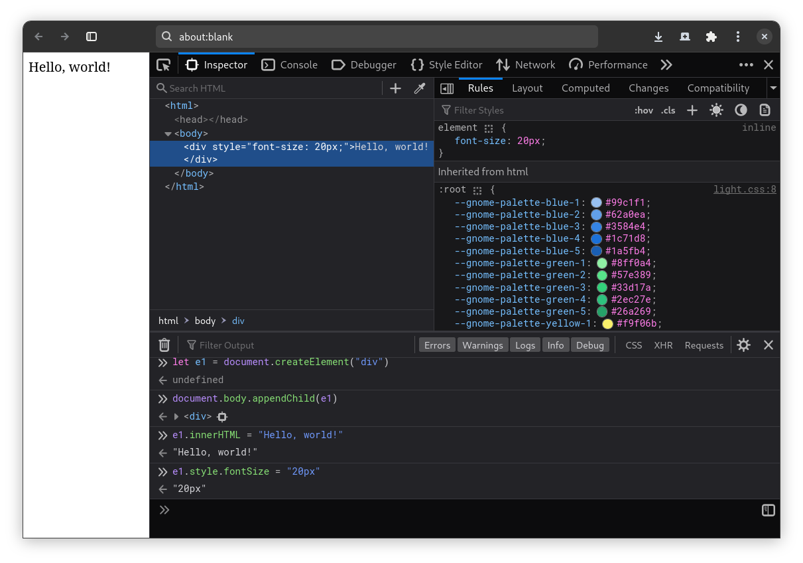

<!-- _backgroundColor: var(--main-color) -->
<!-- _color: white -->
<!-- _paginate: false -->

# Lezione 2

## Browser

---

<script src="../node_modules/mermaid/dist/mermaid.min.js"></script>
<script>mermaid.initialize({startOnLoad:true, theme:"neutral", mirrorActors:false});</script>

<link rel="stylesheet" href="res/styles.css">
<link rel="stylesheet" href="res/fontawesome.css">

# Internet e WWW

Internet è una rete di computer che comunicano tra loro.
_World Wide Web_ è una applicazione di Internet che permette di scambiare documenti ipertestuali, che contengono *link* ad altri documenti.
WWW si basa su protocolli **client-server**.

<div class="container">
<div class="content">
<div class="mermaid">
%%{init: {'theme': 'neutral', 'mirrorActors': false} }%%
sequenceDiagram
    Client->>Server: richiesta
	activate Server
    Server-->>Client: risposta
	deactivate Server

</div>
</div>
</div>

---

## Http

È il protocollo per WWW. Faremo richieste **GET** e **POST**.

```
GET / HTTP 1.1
Host: www.condomini.com/dashboard?condominio=vicolo+corto
```

ci connettiamo a `www.condomini.com`, chiediamo la pagina `/dashboard` e passiamo il parametro `condominio` con valore `vicolo+corto`.

```html
HTTP/1.1 200 OK
Content-Type: text/html

<html>
	<head>
		<title>Titolo</title>
		<style> /* stile css */ </style>
	</head>
	<body> <!-- elementi HTML --> </body>
	<script> /* codice Javascript */ </script>
</html>
```

---

# Il browser web

Il browser è un programma che permette di fare richieste e visualizzare risposte.
Quando viene scaricata la risposta HTTP, il browser interpreta il codice che è arrivato.

1. carica il codice HTML nel **DOM** (Document Object Model).
2. mostra a schermo il **rendering** con lo stile *CSS*.
3. **interpreta** il codice *Javascript*.

In più il browser gestisce gli **eventi** generati dall'utente o dal sistema, come il click del mouse o la pressione di un tasto, e si possono definire con Javascript.

Ora andremo a lavorare su una pagina _statica_, quella che viene scaricata con la prima richiesta HTTP.

---

## Strumenti sviluppatore

<div class="container">
<div class="content" style="max-width: 35%">

Accedete con `ctrl+shift+i` o `cmd+shift+i`.

- **inspector** mostra il DOM e il CSS.

- **network** mostra le richieste HTTP.

- **debugger** visiona l'esecuzione di Javascript.

- **console** per eseguire istruzioni Javascript.

</div>

<div class="content">

</div>
</div>

---

## DOM

Scriviamo un file HTML, ha una struttura ad albero e ogni nodo è un _elemento_.

<div class="container">
<div class="content" style="align-items: unset">

```html
<div class="container">
	<div class="content">
		<h1 id="condomini">Condomini</h1>
		<ul>
			<li>Vicolo Corto</li>
			<li>Bastioni Gran Sasso</li>
		</ul>
	</div>
	<div class="content">
		<h1 id="residenti">Residenti</h1>
		<ul>
			<li>Mario Rossi</li>
			<li>Luigi Verdi</li>
		</ul>
	</div>
</div>
```

</div>
<div class="content">

<div class="container">
<div class="content">
<div class="mermaid" style="max-height:18vh;">
%%{init: {'theme': 'neutral', 'mirrorActors': false} }%%
flowchart TD
	A[div] --> B[div]
	A --> C[div]
	B --> D[h1]
	B --> E[ul]
	C --> F[h1]
	C --> G[ul]
	E --> H[li]
	E --> I[li]
	G --> J[li]
	G --> K[li]
</div>
</div>
</div>

</div>

</div>

La sintassi è `<nome-tag att-1="val-1" ... att-n="val-n">...</nome-tag>`.

---

## Rendering del DOM

Ogni tipo di elemento ha un comportamento di default, vediamolo nel browser.

<html>

<div style="border: 3px solid #224466; padding: 20px; margin-bottom: 20px;">

`file:///home/user/.../condomini.html`
</div>

<div style="border: 3px solid #224466; padding: 20px; margin-bottom: 20px;">
	<div>
		<div>
			<h3>Condomini</h3>
			<ul>
			<li>Vicolo Corto</li>
			<li>Bastioni Gran Sasso</li>
			</ul>
		</div>
		<div>
			<h3>Residenti</h3>
			<ul>
			<li>Mario Rossi</li>
			<li>Luigi Verdi</li>
			</ul>
		</div>
	</div>
</div>
</html>

---

## Css

Cascading Style Sheets è un linguaggio per descrivere lo stile di un documento HTML. Le regole si applicano da quelle più specifiche a quelle più generali.

```css
h1 { color: purple; }

.container { display: flex; align-items: center; flex-direction: row; }

.content { display: flex; width: 100%; align-items: center; flex-direction: column; }

#condomini { color green; }
```

1. **stile inline** `style="color:red"` ha la precedenza su tutte le regole.
2. **id** `#condomini` identifica un elemento.
3. **classe** `.container` e `.content` sono le classi per contenitore e contenuto.
4. **elemento** `h1` mette a neutral il colore di tutti gli h1.

Si possono comporre selettori con spazi, ad esempio `#condomini .container`.

---


## Resa grafica

<html>

<div style="border: 3px solid #224466; padding: 20px; margin-bottom: 20px;">

`file:///home/user/.../condomini.html`
</div>

<div style="border: 3px solid #224466; padding: 20px; margin-bottom: 20px;">
	<div class="container">
		<div class="content">
			<h1 class="h1_mock" id="condomini" style="color: green;">Condomini</h1>
			<ul>
			<li>Vicolo Corto</li>
			<li>Bastioni Gran Sasso</li>
			<li>...</li>
			</ul>
		</div>
		<div class="content">
			<h1 class="h1_mock" id="residenti">Residenti</h1>
			<ul>
			<li>Mario Rossi</li>
			<li>Luigi Verdi</li>
			<li>...</li>
			</ul>
		</div>
		<div class="content">
			<h1>...</h1>
		</div>
	</div>
</div>

<style>
	.h1_mock {
		color: purple;
	}
	
	.container_mock{
		display: flex;
		align-items: center;
		flex-direction: row;
	}
	.content_mock{
		display: flex;
		width: 100%;
		align-items: center;
		flex-direction: column;
	}

	#b1_mock{
		width: 100%;
		height: 50px;
	}
</style>
</html>

---
### Alcuni tag HTML

- `<div>` e `<span>` per raggruppare elementi.
- `<a href="url">testo</a>` per i collegamenti ipertestuali.
- `<ul>` e `<ol>` per liste non ordinate e ordinate e `<li>` per gli elementi.
- `` per le immagini.
- `<svg>...</svg>` per i disegni vettoriali.
- `<input type="text" placeholder="testo">` per i campi di testo.
- `<button onclick="clickHandler()">testo</button>` per i pulsanti.
- `<canvas></canvas>` per disegnare programmaticamente.
- `<video src="url"></video>` per i video.
- `<style>...</style>` per i fogli di stile inline.
- `<link rel="stylesheet" href="url">` per i fogli di stile esterni.
- `<script src="url"></script>` per i file Javascript.


---

## Javascript nel browser

È possibile interagire con il DOM e con il CSS con Javascript per rendere la pagina **dinamica**.

Sono presenti degli **oggetti** sui quali è possibile fare delle operazioni.

- `window` rappresenta la finestra del browser.
- `document` rappresenta il DOM.
- `fetch` permette di fare richieste HTTP.
- `console`, gia visto, permette di scrivere sulla console.

```html
<!-- index.html -->
<script>
	console.log("Hello, world!");
</script>
```

---

## Oggetti in Javascript

Sono _strutture dati_ che contengono **proprietà** (variabili) e **metodi** (funzioni).

```javascript
let obj = {
	key_a: "valore",
	key_b: function () {
		console.log("funzione key_b");
	},
	key_c: {
		key_a: true, // obj.key_c.key_a
		10: null, // obj.key_c[10]
	},
};
```

- **creare un oggetto**: con `obj = {}` viene _istanziato_. `obj` è il _riferimento_.
- **assegnare una proprietà**: `obj.prop = "valore"` o `obj["prop"] = "valore"`.
- **ottenere una proprietà**: `obj.prop` o `obj["prop"]` attraverso _chiavi_ di tipo `Number` e `String`.

---

### Prototype

Gli oggetti hanno un _prototype_ da cui **ereditano** proprietà e metodi.

<div class="container">
<div class="content" style="align-items: unset">

```javascript
let o1 = { prop_a: "valore" };

let o2 = Object.create(o1);
o2.prop_b = 10;

o1.prop_a; // "valore"
o2.prop_a; // "valore"

o1.prop_b; // undefined
o2.prop_b; // 10
```

Tutti gli oggetti ereditano da `Object`.

```javascript
Object.getPrototypeOf(o2); // o1
Object.getPrototypeOf(o1); // Object
```

<style>
.styleOthers > line {
	stroke-width: 0px;
}
</style>

</div>
<div class="content">
<div class="container">
<div class="content" style="align-items: unset">
<div class="mermaid" style="max-height:27vh;">
%%{init: {'theme': 'neutral', 'mirrorActors': false} }%%
classDiagram
	class Object {
		String: toString()
		Object: getPrototypeOf(Object)$
	}
	class  Others["..."]:::styleOthers{
    }
	class Element{
		String: innerHTML
		setAttribute(name, value)
	}
	class o1 {
		String: prop_a
	}
	class o2 {
		Number: prop_b
	}
	Object <|-- o1
	o1 <| -- o2
	Others <|-- Element
	Object <|-- Others

</div>
</div>
</div>
</div>
</div>

---

### Array in Javascript

Sono _oggetti ordinati_, **iterables** quindi si possono scorrere con un ciclo.

<div class="container">
<div class="content" style="align-items: unset">

```javascript
let obj = {
	0: "elemento_1",
	1: "elemento_2",
	2: "elemento_2",
};

obj[0]; // "elemento_1"
```

</div>
<div class="content" style="align-items: unset">

```javascript
let arr = ["elemento_1", "elemento_2",
			"elemento_3"];

arr[0]; // "elemento_1"
arr.length; // 3

arr.push("elemento_4"); // alla fine
arr.pop(); // rimuovi l'ultimo
arr.indexOf("elemento_2"); // 1
```

</div>
</div>

- `for (let i = 0; i < arr.length; i++) { ... }` usa l'indice.
- `for (let elem of arr) { ... }` usa l'elemento.
- `arr.forEach(function(elem, i) { ... })` usa l'elemento e l'indice.

---

### Stringhe

Sono un tipo di dato primitivo ed _immutabile_.

```javascript
let s = "Hello, world!";
let t = String("Hello, world!");

s.length; // 13
s.replace("world", "everybody"); // "Hello, everybody!"

s.at(0); // "H"
s.at(1); // "e"
s.at(s.length - 1); // "!"

s.indexOf("o"); // 4

s.split(","); // ["Hello", " world!"]
s.split(",").forEach((s) => s.trim()); // ["Hello", "world!"]

let a = "ciao".split(""); // ["c", "i", "a", "o"]
let s = a.join(""); // "ciao"
```

Caratteri di escape: `\n` a capo, `\t` tab, `\"` virgolette, `\'` apici, `\\` backslash.

---

<!-- _backgroundColor: var(--todo-color) -->
# Api DOM

  - `document.createElement()` crea un `Element`.
  - `document.getElementById()` trova un `Element` con un id.
  - `document.getElementsByClassName()` trova elementi con una classe.

---

## Listening di eventi

Il browser rileva gli _eventi_ ai quali possiamo agganciare delle funzioni. Gli eventi accadono *indipendentemente dall'esecuzione sequenziale*.

```html
<div class="container">
	<button id="b1">Clicca</button>
</div>
<script>
	function clickHandler() { /* ... */  } // funzione eseguita quando si verifica l'evento

	document.getElementById("b1").addEventListener("click", clickHandler);
</script>
```

Dopo la pressione del tasto la pagina deve essere _aggiornata_.

```html
<div class="container">
	<button id="b1">Clicca</button>
	<div style="color: red" class="content">Cliccato</div>
</div>
<script> // ...	</script>
```

---

## Handling di eventi

Ci si può agganciare anche con `<button onclick="clickHandler()">Clicca</button>`.

```javascript
function clickHandler() {
	// otteniamo il riferimento di un nuovo elemento DOM
	let elem = document.createElement("div");

	// impostiamo il contenuto, la classe e lo stile
	elem.innerHTML = "Cliccato" + " " + Date();
	elem.setAttribute("class", "content");
	elem.style.color = "red";

	elem.attributes; // [class="content", style="color: red;"]

	// aggiungiamo il nuovo elemento al primo elemento di classe container del documento
	document.getElementsByClassName("container")[0].appendChild(elem);
}
```

<div class="content">

| `<button>` | `<input type="text">` | `<div>` | `<body>`| `document` |
| ---------- | --------------------- | ------- | ---| ------ |
| `click`    | `change`              | `mouseover` | `keydown`| `load` |

</div>

---

## Pattern di progettazione di interfacce grafiche

### _Templating_

- Generazione di pagine HTML statiche lato server.
  > _PHP_, _JSP_, _pug_, ...

### _Imperativo_

- Javascript usando solo API DOM o _librerie_.
  > _jquery_, _lodash_, ..., e come abbiamo fatto fino ad ora.

### _Dichiarativo_

- **Framework** orientati a componenti.
  > Come vedremo nella lezione 5... Prima dobbiamo rendere le pagine attive!
