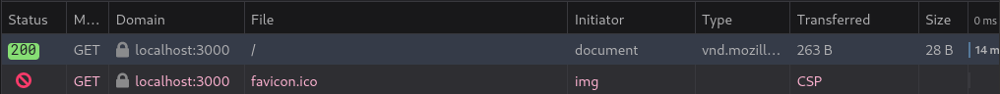

<!-- _backgroundColor: var(--main-color) -->
<!-- _color: white -->
<!-- _paginate: false -->

# Lezione 3
## Controller

---

<script src="../node_modules/mermaid/dist/mermaid.min.js"></script>
<script>mermaid.initialize({startOnLoad:true, theme:"neutral", mirrorActors:false});</script>

<link rel="stylesheet" href="res/styles.css">
<link rel="stylesheet" href="res/fontawesome.css">

# Il pattern MVC

Utilizziamo questo *pattern architetturale* per organizzare il codice e rendere la pagina **attiva**, cioè fare richieste *asincrone* al server e aggiornare la vista.

<div class="container">
<div class="content">

- Il **Backend** è il lato server.
	- Il **Controller** è il gestore delle richieste e delle risposte.
	- Il **Model** è la rappresentazione dei dati e delle regole di business.

- La **Frontend** è il lato client.
	- La **View** è la presentazione all'utente.
</div>

<div class="content">
<div class="container">
<div class="content">
<div class="mermaid">
%%{init: {'theme': 'neutral', 'mirrorActors': false} }%%
flowchart LR
	USER[Utente] -->|richiede| CONTROLLER[Controller]
	USER -->|vede| VIEW
	subgraph Modello
		subgraph Backend
			CONTROLLER --> MODEL[Model]
		end
		subgraph Frontend
			VIEW[View]
			CONTROLLER --> VIEW
			VIEW --> CONTROLLER
			MODEL --> VIEW
		end
	end
	style USER fill:#224466,color:#fff
</div>
</div>
</div>

</div>
</div>

---

## Diagramma di sequenza

L'utente contatta il server all'url principale e ottiene la pagina web. Poi utilizza le api per ottenere i dati.

<div class="container">
<div class="content">
<div class="mermaid" style="width: 30%">
%%{init: {'theme': 'neutral', 'mirrorActors': false} }%%
sequenceDiagram
	actor Utente
	Utente ->> Controller: richiesta iniziale
	Controller ->> View: ottiene pagina
	View -->> Utente: pagina web
	Utente ->> View: vede
	View -->> Controller: invia dati
	Controller ->> Model: persistenza dati
	Model -->> View: aggiornamento dati
	View -->> Utente: vede dati aggiornati
</div>
</div>
</div>

---

## Git

È un buon momento per iniziare a salvare le versioni del codice che scriviamo. Con *git* possiamo fare modifiche con ordine e collaborare con altri programmatori. 

- `git branch`: per creare un nuovo *ramo di sviluppo*.
- `git commit`: per salvare le modifiche.
- `git checkout`: per operare sulla versione di un branch in locale.
- `git merge`: per unire i branch.

<div class="content">
<div class="mermaid" style="width: 30%">
%%{init: {'theme': 'neutral', 'mirrorActors': false} }%%
gitGraph
    commit id: "git init"
    commit id: "npm init"
    branch develop
    checkout develop
    commit id: "aggiunta backend"
    commit
    commit id: "fix backend"
    checkout main
    merge develop id: "backend"
	checkout develop
	commit id: "aggiunta frontend"
	commit
	commit id: "fix frontend"
	checkout main
	merge develop id: "frontend"
</div>
</div>


---

# Backend

Utilizziamo Node.js per il backend, impostiamo il progetto:

```bash
mkdir condomini # creiamo una directory per il progetto
cd condomini # posizionamoci nella directory
npm init -y # avviamo il progetto
```

Verrà creato il file `package.json` che contiene le informazioni del progetto.

```json
{
	"name": "condomini",
	...
	"type": "module", // utilizziamo moduli ES6+
	...
	"scripts": { // aggiungiamo uno script per l'avvio
		"serve": "node server.js"
	}
}
```

---

## Server HTTP

Possiamo creare il nuovo file di script con `touch server.js`.

```javascript
import http from 'http' // importiamo il modulo http integrato

const app = http.createServer() // creiamo il server

app.on('request', (req, res) => { // gestiamo le richieste con una funzione di callback
	res.end('Hello, world!') // rispondiamo
})

app.listen(3000) // mettiamo in ascolto il server sulla porta 3000
```
Salviamo ed eseguiamo `npm run serve` e visualizziamo il risultato nel browser:

<div class="container">
<div class="content" style="border: 3px solid #224466; padding: 20px; margin: 20px;">

`http://localhost:3000`
</div>
<div class="content" style="border: 3px solid #224466; padding: 20px; margin: 20px;">

Hello, world!
</div>
</div>

---


Proviamo a inviare dei marcatori HTML. Possiamo anche rendere la pagina *dinamica*, simulando tecniche di *templating*.

```javascript
app.on('request', (req, res) => {
	let date = Date();
	res.setHeader('Content-Type', 'text/html'); // imposta l'header HTTP
	res.end('<html><div style="color: red;">Hello, world, it\'s ' + date + '</div></html>')
});
```

<div class="container">
<div class="content" style="border: 3px solid #224466; padding: 20px; margin-right: 20px;">

`http://localhost:3000`
</div>
<div class="content" style="border: 3px solid #224466; padding: 20px; margin-left: 20px; color: red;">

Hello, world, it's Fri Mar 22...
</div>
</div>

Per via della *confusione delle preoccupazioni* introdotta dal templating sceglieremo l'approccio *MVC*. Inoltre, per via della *complessità* introdotta dagli header HTTP, useremo una *libreria* che astrae queste operazioni.

---

## Pacchetti NPM

L'ecosistema di Node.js è basato su pacchetti, e ce ne sono molti *open source* disponibili su [npmjs.com](https://www.npmjs.com/) ed ottenibili con il comando `npm install`.

Installiamo **Express.js**.

```bash
npm install express
```

Vediamo che in `package.json` è stato aggiunto il pacchetto.

```json
"dependencies": {
	"express": "^4.18.2"
}
```

Il codice del pacchetto è salvato in `node_modules`. Possiamo ignorare il versionamento di questa directory aggiungendola a  `.gitignore`.

È anche stato generato `package-lock.json` che *blocca* le versioni dei pacchetti.

---

## Express.js

Disponiamo i files statici nella directory `public`, che per ora faranno da *View*.

```javascript
import express from 'express'; // importiamo il modulo express

const app = express(); // creiamo l'applicazione

app.use(express.static('public')); // serviamo i files statici in public/

app.listen(3000); // mettiamo in ascolto l'applicazione sulla porta 3000
```

Express rileva in automatico il **MIME type** dei files e lo invia correttamente.

<div class="content">

| `condomini.html` | `styles.css` | `condomini.json`   | `logo.png`  |
| ---------------- | ------------ | ------------------ | ----------- |
| `text/html`      | `text/css`   | `application/json` | `image/png` |
</div>

---

## Struttura del progetto e modalità di sviluppo
<!-- _backgroundColor: var(--todo-color) -->

<div class="container">
<div class="content" style="align-items: unset">

```
condomini
├── .git
├── .gitignore
├── node_modules
├── package.json
├── package-lock.json
├── public
│   ├── css
│   │   └── styles.css
│   ├── index.html
│   └── script.js
└── server.js
```

</div>
<div class="content" style="align-items: unset">

- **view**: i files statici vengono serviti in automatico.
- **controller**: il controllo delle richieste è gestito da Express, tramite il pattern *middleware*

</div>
</div>

---

### Pattern middleware

Introdotto gia in *connect* , semplifica il flusso di richieste e risposte.

```javascript
function loggaDataEInviaSaluto(req, res, next) {
	let date = Date();
	console.log("richiesta ricevuta in " + date);
	res.send("Hello, world, it's " + date);
}

app.use(loggaDataEInviaSaluto);
```
<div class="content" style="font-size: 16pt">

req: *Request* | res: *Response* | next: *function(Request, Response, function)*
--------|----------|---------------
url: *string*     | send: *function(string)*     | 
body: *Object* | status: *function(number)* | 
headers: *IncomingHttpHeaders*| header: *function(string, string)*  | 
</div>

`next` è una funzione che passa la richiesta al prossimo middleware.

---

Il browser cercherà di scaricare anche `/favicon.ico`, l'icona del sito, quindi la richiesta sarà loggata due volte: vediamo come risolvere:



```javascript
function loggaDataEInviaSaluto(req, res, next) { ...  }

function ignoraFavicon(req, res, next) {
	if (req.url == '/favicon.ico') {
		res.end(); // interrompiamo la richiesta
		return;
	}
	next(); // passiamo la richiesta al prossimo middleware
}

app.use(ignoraFavicon); // 1: ignora la richiesta del favicon
app.use(loggaDataEInviaSaluto); // 2: logga la data e invia il saluto
```

Così i middleware eseguono in sequenza e `/favicon.ico` non viene loggato.

---

### POST e GET

Configuriamo degli *endpoints* per le richieste ad *url* specifici.

```javascript
app.get("/hello", (req, res) { // richiesta HTTP GET
	res.send("Hello, world!");
});

app.post("/hello", (req, res) { // richiesta HTTP POST
	res.send("Hello, world!");
});
```

Proviamo la richiesta *GET* con il browser, che rimpiazza la pagina corrente:

<div class="container">
<div class="content" style="border: 3px solid #224466; padding: 20px; margin-right: 20px;">

`http://localhost:3000/hello`
</div>
<div class="content" style="border: 3px solid #224466; padding: 20px; margin-left: 20px">

Hello, world!
</div>
</div>

Come possiamo effettuare una richiesta *POST*?

---
### Richieste post dal browser

Usando *form* html sincrone:
``` html
<form action="/hello" method="post">
	<input type="submit" value="Invia richiesta">
</form>
```

Con *Ajax* aggiorniamo la pagina senza ricaricare, ma si cade nel *callback hell*:
```javascript
var xhr = new XMLHttpRequest();
xhr.open("POST", "/hello", true);
xhr.onreadystatechange = function () {
	if (xhr.readyState == 4 && xhr.status == 200) // HTTP 200
		console.log(xhr.responseText); // gestione della risposta
}
xhr.send();
```

Usando il più moderno *fetch* e i *Promise*:
``` javascript
let response = await fetch("/hello", { method: "POST" })
```

---

### Asincronia in javascript

Le operazioni *sincrone* **bloccano** il thread principale, mentre quelle *asincrone* vengono eseguite in concorrenza dalla *queue degli eventi*.

<div class="container">
<div class="content">

### Modello sincrono
</br>
</br>
<div class="mermaid">
%%{init: {'theme': 'neutral', 'mirrorActors': false} }%%
sequenceDiagram
	Caricamento pagina ->> Download condomini: 1ms
    break
        Download condomini ->> Download condomini: 200ms
    end
    Download condomini ->> Download residenti: 
    break
        Download residenti ->> Download residenti: 200ms
    end
    Download residenti ->> Popolamento interfaccia: 2ms
</div>
</br>
</br>

403ms
</div>
<div class="content">

### Modello asincrono
</br>
</br>
<div class="mermaid">
%%{init: {'theme': 'neutral', 'mirrorActors': false} }%%
sequenceDiagram
	Caricamento pagina ->> Download condomini e residenti: 1ms
    break
        Download condomini e residenti ->> Download condomini e residenti: 201ms
    end
    Download condomini e residenti ->> Popolamento interfaccia: 2ms
</div>
</br>
</br>

204ms
</div>
</div>

---

Il modello di risposta ad eventi con callback presenta problemi di manutenibilità.

promises
then

async
await

---
<div class="container">
<div class="content">

```javascript
function f1(callback1, callback2){
	console.log("f1")
	callback1(callback2)
}
function f2(callback){
	console.log("f1")
	callback()
}
function f3(){
	console.log("f3")
}

f1(f2, f3)
```
</div>

<div class="content">

```
```
</div>

<div class="content">

```
```
</div>
</div>

---

## Json

*JavaScript Object Notation* è un formato per scambiare dati. Ha la sintassi di un oggetto ma si devono *virgolettare* i nomi delle proprietà. Valori, array e oggetti sono valido JSON.

<div class="container">
<div class="content" style="align-items: unset">

```json
{
    "via": "Vicolo Corto",
    "residenti":
    [
        {
            "nome": "Mario",
            "cognome": "Rossi"
        },
        {
            "nome": "Luigi",
            "cognome": "Verdi"
        }
    ]
}
```

</div>
<div class="content">

<div class="container">
<div class="content">
<div class="mermaid" style="max-height:18vh;">
%%{init: {'theme': 'neutral', 'mirrorActors': false} }%%
flowchart TD
	A[object] --> B[via]
	B --> D[Vicolo Corto]
	A --> C[residenti]
	C --> E[list]
	E --> F[object]
	E --> G[object]
	F --> H[nome]
	F --> I[cognome]
	G --> J[nome]
	G --> K[cognome]
	H --> L[Mario]
	I --> M[Rossi]
	J --> N[Luigi]
	K --> O[Verdi]
	style A fill:#224466,color:#fff
	style E fill:#224466,color:#fff
	style F fill:#224466,color:#fff
	style G fill:#224466,color:#fff
	style B fill:#F6F8FA
	style C fill:#F6F8FA
	style H fill:#F6F8FA
	style I fill:#F6F8FA
	style J fill:#F6F8FA
	style K fill:#F6F8FA
</div>
</div>
</div>

</div>

</div>

---

invio dati con POST

console.log(res.body)
	bisogna attendere che arrivi tutto
	JSON.parse

---

body parser
	middleware

---

dati di esempio

import export

---

poplamento dell'interfaccia con fetch

1 costruire html lato server ed inviare
2 costruire html lato client con dati fetchati
	vedremo framework frontend
